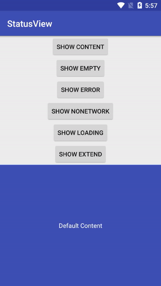

<div style="display: flex;flex-direction: row;justify-content: center" width="100%">
      </img>
</div>

# StatusView 介绍 
[](https://jitpack.io/#Enlogty/StatusView)

可以帮助android开发者减轻多种状态页面切换的代码量，如NoNetwork、Error、Empty等页面轻松切换，xml中自定义视图内容。
自动保存view的状态，不会因为切换页面而丢失状态。
## 引入


* Gradle 
   ```
   allprojects {
		repositories {
			...
			maven { url 'https://jitpack.io' }
		}
	}
   ```	
   ```
   implementation 'com.github.Enlogty:StatusView:1.0.1'
   ```
   
      
## 使用

* #### xml中使用,默认显示ContentView里面的视图
* #### StatusRelativeLayout可以根据需求更改为StatusFrameLayout或者StatusLinearLayout
```xml
 <com.enlogy.statusview.StatusRelativeLayout
        android:id="@+id/status_view"
        android:layout_width="match_parent"
        android:layout_height="match_parent"
        app:rContentView="@layout/status_content"
        app:rEmptyView="@layout/status_empty"
        app:rErrorView="@layout/status_error"
        app:rExtendView="@layout/status_extend"
        app:rLoadingView="@layout/status_loading"
        app:rNoNetworkView="@layout/status_no_network" />

or
//当StatusRelativeLayout布局里面同时存在child view和 app:rContentView="@layout/status_content"时，默认显示rContentView
的内容，如果只存在child view则显示child view。

//推荐，此种形式布局层次更少
<com.enlogy.statusview.StatusRelativeLayout
        android:id="@+id/status_view"
        android:layout_width="match_parent"
        android:layout_height="match_parent"
        app:rEmptyView="@layout/status_empty"
        app:rErrorView="@layout/status_error"
        app:rExtendView="@layout/status_extend"
        app:rLoadingView="@layout/status_loading"
        app:rNoNetworkView="@layout/status_no_network">
	<TextView
	android:id="@+id/tv"	  
	android:layout_width="wrap_content"
        android:layout_height="wrap_content"
	android:text="Hello World"/>
	
	<Button
        android:layout_below="@+id/tv"
        android:layout_width="wrap_content"
        android:layout_height="wrap_content"
        android:layout_gravity="center"
        android:text="OK"/>
		
</com.enlogy.statusview.StatusRelativeLayout>
```
* #### 代码中切换布局  
```java
 //声明
 private StatusView statusView;
 //使用,单一调用直接切换视图
 statusView.showContent();//主视图
 statusView.showEmptyContent();//空视图
 statusView.showErrorContent();//错误视图
 statusView.showNoNetworkContent();//无网络视图
 statusView.showLoadingContent();//加载中视图
 statusView.showExtendContent();//扩展视图
```      
* #### 任意视图chlid view的点击监听
```java
 //声明
 private StatusView statusView;
 //使用,根据xml中对应view的id，进行点击事件的监听
 statusView.setOnItemClickListener(R.id.tv, new View.OnClickListener() {
            @Override
            public void onClick(View v) {
                Toast.makeText(MainActivity.this,"Hello World !!!",Toast.LENGTH_SHORT).show();
            }
        });
```  
## 说明
* #### 自定义属性说明
```xml
使用StatusRelativeLayout时，自定义属性对应r开头
rContentView 主视图
rEmptyView 空视图
rErrorView 错误视图
rExtendView 扩展视图
rLoadingView 加载中视图
rNoNetworkView 无网络视图

or

使用StatusFrameLayout时，自定义属性对应f开头
fContentView 主视图
fEmptyView 空视图
fErrorView 错误视图
fExtendView 扩展视图
fLoadingView 加载中视图
fNoNetworkView 无网络视图

or

使用StatusLinearLayout时，自定义属性对应l开头
lContentView 主视图
lEmptyView 空视图
lErrorView 错误视图
lExtendView 扩展视图
lLoadingView 加载中视图
lNoNetworkView 无网络视图
```
* #### 其它常用方法、常量
```java
//状态码
StatusView.STATUS_CONTENT 主视图
StatusView.STATUS_LOADING 加载中视图
StatusView.STATUS_EMPTY 空视图
StatusView.STATUS_ERROR 错误视图
StatusView.STATUS_NO_NETWORK 无网络视图
StatusView.STATUS_EXTEND 扩展视图
//方法
//返回当前的试图状态
int viewStatus = statusView.getViewStatus();
```

## 效果
[apk下载](https://github.com/Enlogty/StatusView/blob/master/apk/StatusViewSample.apk?raw=true)



###  [StatusView](https://github.com/Enlogty/StatusView)  


[![License][licensesvg]][license]
## License 
```
Copyright (C)  Enlogty(https://github.com/Enlogty/StatusView)

Licensed under the Apache License, Version 2.0 (the "License");
you may not use this file except in compliance with the License.
You may obtain a copy of the License at

     http://www.apache.org/licenses/LICENSE-2.0

Unless required by applicable law or agreed to in writing, software
distributed under the License is distributed on an "AS IS" BASIS,
WITHOUT WARRANTIES OR CONDITIONS OF ANY KIND, either express or implied.
See the License for the specific language governing permissions and
limitations under the License.
```
